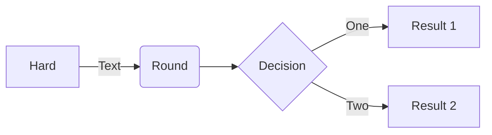
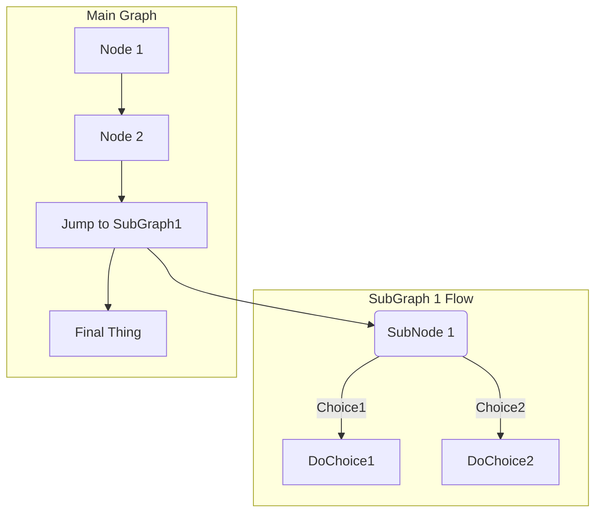
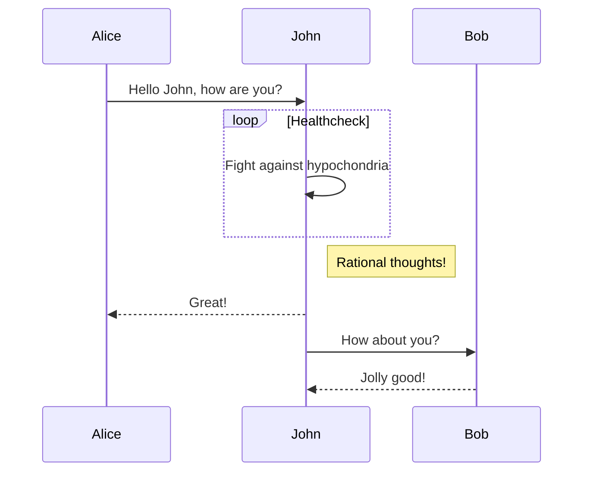
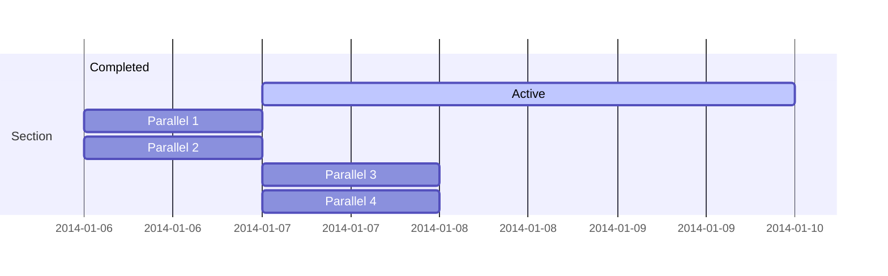
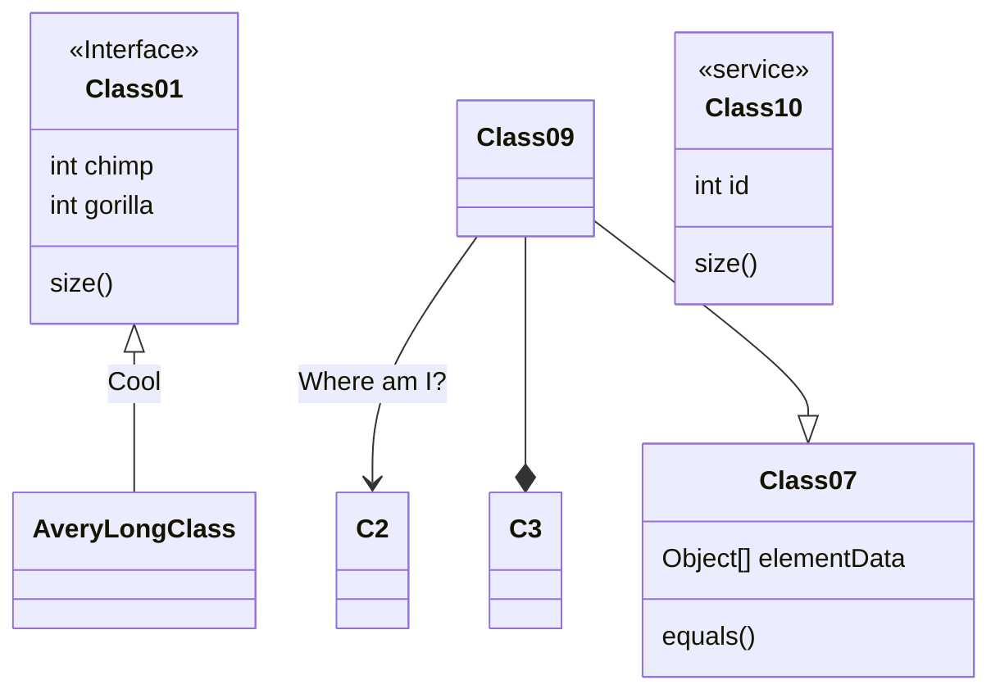
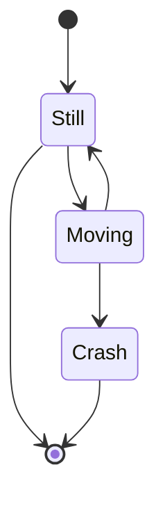
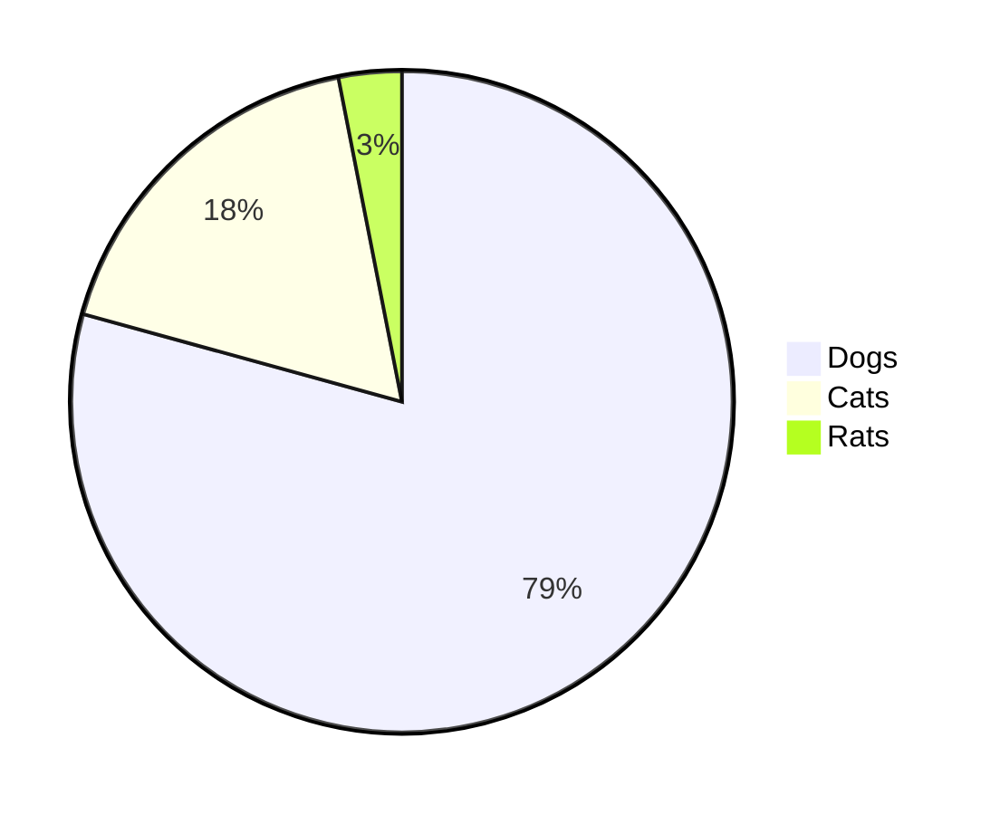
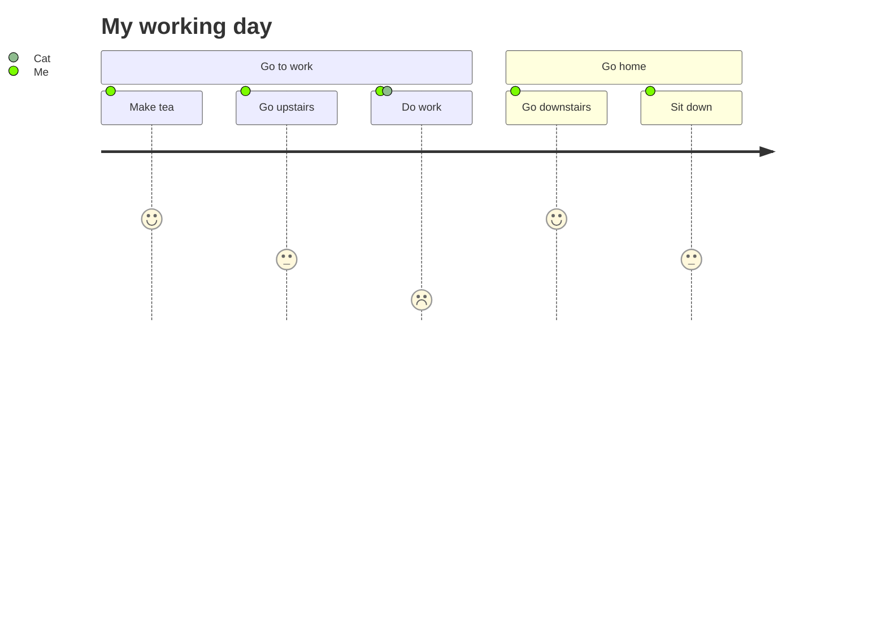
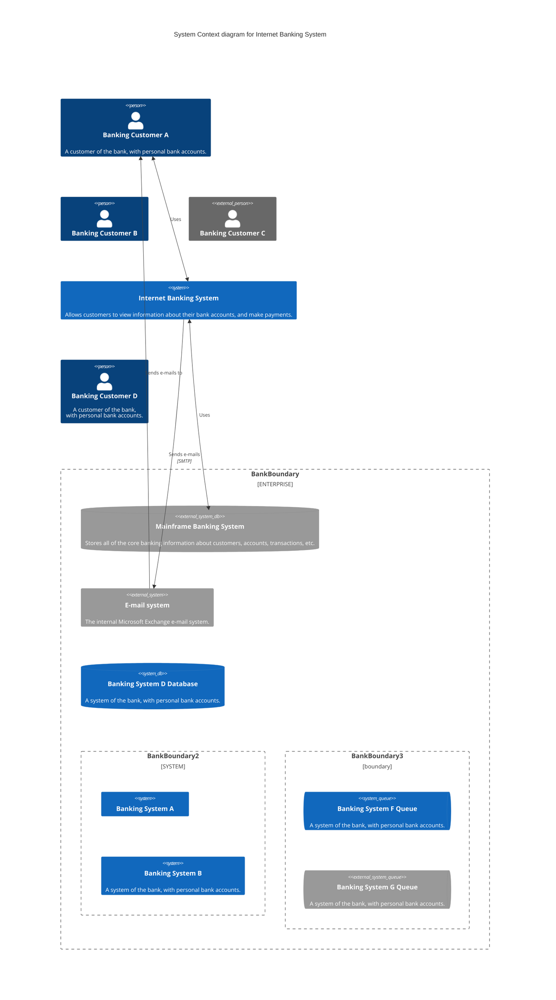

```mermaid
gantt
    title Git Issues - days since last update
    dateFormat  X
    axisFormat %s

    section Issue19062
    71   : 0, 71
    section Issue19401
    36   : 0, 36
    section Issue193
    34   : 0, 34
    section Issue7441
    9    : 0, 9
    section Issue1300
    5    : 0, 5
```

____
# Headings

```
# Heading 1
## Heading 2
### Heading 3
#### Heading 4
##### Heading 5
```

# Heading 1
## Heading 2
### Heading 3
#### Heading 4
##### Heading 5

```
<h1>Heading 1</h1>
<h2>Heading 2</h2>
<h3>Heading 3</h3>
<h4>Heading 4</h4>
<h5>Heading 5</h5>
```

<h1>Heading 1</h1>
<h2>Heading 2</h2>
<h3>Heading 3</h3>
<h4>Heading 4</h4>
<h5>Heading 5</h5>

Heading 1
=
Heading 2
-

____
## Text styles

You can indicate emphasis with bold, italic, strikethrough, subscript, or superscript text in comment fields and `.md` files.

|Style|Syntax|Keyboard shortcut|Example|Output|
|---|---|---|---|---|
|Bold|`** **` or `__ __`|Command+B (Mac) or Ctrl+B (Windows/Linux)|`**This is bold text**`|**This is bold text**|
|Italic|`* *` or `_ _`|Command+I (Mac) or Ctrl+I (Windows/Linux)|`_This text is italicized_`|_This text is italicized_|
|Strikethrough|`~~ ~~`|None|`~~This was mistaken text~~`|~~This was mistaken text~~|
|Bold and nested italic|`** **` and `_ _`|None|`**This text is _extremely_ important**`|**This text is _extremely_ important**|
|All bold and italic|`*** ***`|None|`***All this text is important***`|_**All this text is important**_|
|Subscript|`<sub> </sub>`|None|`This is a <sub>subscript</sub> text`|This is <sub>subscript</sub>|
|Superscript|`<sup> </sup> or ^ ^`|None|`This is a <sup>superscript</sup> text`| This is <sup>superscript</sup> |
|Highlighting|`<mark></mark> or == == `|None|`This is a ==Highlighted== text`|==Highlighted== <mark>Highlighted</mark> |

```
Boxed
<table><tr><td>The quick brown fox jumps over the lazy dog.</td></tr></table>
```
###### Boxed
<table><tr><td>The quick brown fox jumps over the lazy dog.</td></tr></table>

____
### Blockquotes

```
> The quick brown fox jumps over the lazy dog.
> The quick brown fox jumps over the lazy dog.
> 
> The quick brown fox jumps over the lazy dog.
> 
> The quick brown fox jumps over the lazy dog.
> The quick brown fox jumps over the lazy dog.
>> The quick brown fox jumps over the lazy dog.
>>> The quick brown fox jumps over the lazy dog.
> **The quick brown fox** *jumps over the lazy dog.*
```

> The quick brown fox jumps over the lazy dog.

> The quick brown fox jumps over the lazy dog.
> 
> The quick brown fox jumps over the lazy dog.
> 
> The quick brown fox jumps over the lazy dog.

> The quick brown fox jumps over the lazy dog.
>> The quick brown fox jumps over the lazy dog.
>>> The quick brown fox jumps over the lazy dog.

> **The quick brown fox** *jumps over the lazy dog.*


____
## Fenced code blocks

You can create fenced code blocks by placing triple backticks ` ``` ` before and after the code block. We recommend placing a blank line before and after code blocks to make the raw formatting easier to read.

```
function test() {
  console.log("notice the blank line before this function?");
}
```

**Tip:** To preserve your formatting within a list, make sure to indent non-fenced code blocks by eight spaces.

To display triple backticks in a fenced code block, wrap them inside quadruple backticks.
````
```
Look! You can see my backticks.
```
````


If you prefer, or your code example contains 3 backticks, you can replace backticks with the `~` character.
```
With backtics

~~~
Without backticks
~~~
```


# Syntax Highlighting for Code blocks
A class method is an instance method of the class object. When a new class is created, an object of type `Class` is initialized and assigned to a global constant (Mobile in this case).
```
public static String monthNames[] = {"January", "February", "March", "April", "May", "June", "July", "August", "September", "October", "November", "December"};
```

```java
public static String monthNames[] = {"January", "February", "March", "April", "May", "June", "July", "August", "September", "October", "November", "December"};
```

# Syntax Highlighting  Definitions
Syntax highlighting for code blocks

Imports code from [CodeMirror](https://github.com/codemirror/CodeMirror/)
Supported syntax types:
actionscript3, apache, applescript, asp, brainfuck, c, cfm, cjs, clojure, cmake, coffee-script, coffeescript, coffee, cpp - C++, cs ,csharp, css, csv, bash, sh, zsh, diff, elixir, erb - HTML + Embedded Ruby, go, haml, http, java, javascript, js, json, jsx, less, lolcode, make - Makefile, markdown, matlab, nginx, objectivec, pascal, PHP, Perl, python, profile - python profiler output, rust, salt, saltstate - Salt, shell, sh, zsh, bash - Shell scripting, scss, sql, svg, swift, rb, jruby, ruby, smalltalk,vim, viml - Vim Script, volt, vhdl, vue, xml - XML and also used for HTML with inline CSS and Javascript, yaml](<apl, asciiarmor, asn.1, asterisk, clike, clojure, cmake, cobol, coffeescript, commonlisp, crystal, css, cypher, d, dart, diff, django, dockerfile, dtd, dylan, ebnf, ecl, eiffel, elm, erlang, factor, fcl, forth, fortran, gas, gfm, gherkin, go, groovy, haml, handlebars, haskell-literate, haskell, haxe, htmlembedded, htmlmixed, http, idl, javascript, jinja2, jsx, julia, livescript, lua, markdown, mathematica, mbox, mirc, mllike, modelica, mscgen, mumps, nginx, nsis, ntriples, octave, oz, pascal, pegjs, perl, php, pig, powershell, properties, protobuf, pug, puppet, python, q, r, rpm, rst, ruby, rust, sas, sass, scheme, shell, sieve, slim, smalltalk, smarty, solr, soy, sparql, spreadsheet, sql, stex, stylus, swift, tcl, textile, tiddlywiki, tiki, toml, tornado, troff, ttcn-cfg, ttcn, turtle, twig, vb, vbscript, velocity, verilog, vhdl, vue, wast, webidl, xml, xquery, yacas, yaml-frontmatter, yaml, z80

non-codemirror based syntax highlighting:
console, 


____
## CriticMarkup

There are five types of Critic marks: 

* Addition `{++ ++}`
* Deletion `{-- --}`
* Substitution `{~~ ~> ~~}`
* Comment `{>> <<}`
* Highlight `{== ==}{>> <<}`

|Markdown|Result|
|---|---|
|This is {--is --}a test.|This is ~~is~~ a test.|
|This {++is ++}a test.|This is a test.|
|This {~~isn't~>is~~} a test.|This ~~isn’t~~is a test.|
|This is a {==test==}.|This is a ==test==.|
|This is a test{>>What is it a test of?<<}.|This is a test.|

____
# Lists


```
1. First level
    1. Second level
        - Third level
            - Fourth level
2. First level
    1. Second level
3. First level
    1. Second level
```

1. First level
    1. Second level
        - Third level
            - Fourth level
2. First level
    1. Second level
3. First level
    1. Second level
    

``` 
- This is an unordered list
- Of items

1. This is an ordered list
1. The numbers do not matter
1. This says 3
    * This is a nested list
    * Of items
        1. This is a nested
        2. List of items
```
- This is an unordered list
- Of items

1. This is an ordered list
2. The numbers do not matter
3. This says 3
    * This is a nested list
    * Of items
        1. This is a nested
        2. List of items

## Multi level List Example
``` 
1. First ordered list item
2. Another item
    * Unordered sub-list, lead with 4 spaces
1. Actual numbers don't matter, just that it's a number
    1. Ordered sub-list, lead with 4 spaces
        1. More sub, lead with 4 spaces
            3. Notice how the numbers can get janky
            1. Notice how the numbers can get janky
        2. previous sub
    2. previous sub
4. And another item.

1. Main level
    1. second level
        1. third level
            - fourth level
        2. third level
    2. Second level
7. main level


Unordered list:

- This is a list
    - This is a sub list, lead with 4 spaces
        - and a further sublist, lead with 4 spaces
            - and still more subing
    - back down a few
    1. add in some ordered stuff
    3. more ordered stuff
        2. sub ordered stuff
            1. Hi There
- Back to the future
   
   Some text that should be aligned with the above item.

* Unordered list can use asterisks
- Or minuses
+ Or pluses
```

1. First ordered list item
2. Another item
    * Unordered sub-list, lead with 4 spaces
1. Actual numbers don't matter, just that it's a number
    1. Ordered sub-list, lead with 4 spaces
        1. More sub, lead with 4 spaces
            3. Notice how the numbers can get janky
            1. Notice how the numbers can get janky
        2. previous sub
    2. previous sub
4. And another item.

1. Main level
    1. second level
        1. third level
            - fourth level
        2. third level
    2. Second level
7. main level

Unordered list:

- This is a list
    - This is a sub list, lead with 4 spaces
        - and a further sublist, lead with 4 spaces
            - and still more subing
    - back down a few
    1. add in some ordered stuff
    3. more ordered stuff
        2. sub ordered stuff
            1. Hi There
- Back to the future
   
   Some text that should be aligned with the above item.

* Unordered list can use asterisks
- Or minuses
+ Or pluses

#### Manual directory list:
.
├─ README.md
├─ foo
│ ├─ README.md
│ ├─ one.md
│ └─ two.md
└─ bar
├─ README.md
├─ three.md
└─ four.md


____
### Checklists
You can create what looks like checkboxes and display completed tasks with a checkmark. It takes the form of an unordered list with the first characters being a set of square brackets which **_MUST_** have a space in them. For a completed task, add either a lower or uppercase "X":

- [ ]  Incomplete _task_
- [x]  Completed **task**
    - [ ]  Incomplete ~~subtask~~
    - [x]  Completed subtask

```md
- [ ] Incomplete _task_
- [x] Completed **task**
  - [ ] Incomplete ~~subtask~~
  - [x] Completed subtask
```

____
# Tables

```
|   |   |   |
|---|---|---|
|The quick brown fox jumps over the lazy dog.|The quick brown fox jumps over the lazy dog.|The quick brown fox jumps over the lazy dog.|
```
Produces:

|   |   |   |
|---|---|---|
|The quick brown fox jumps over the lazy dog.|The quick brown fox jumps over the lazy dog.|The quick brown fox jumps over the lazy dog.|


```
| Default | Left align | Center align | Right align |
| - | :- | :-: | -: |
| 9999999999 | 9999999999 | 9999999999 | 9999999999 |
| 999999999 | 999999999 | 999999999 | 999999999 |
| 99999999 | 99999999 | 99999999 | 99999999 |
| 9999999 | 9999999 | 9999999 | 9999999 |


| Default    | Left align | Center align | Right align |
| ---------- | :--------- | :----------: | ----------: |
| 9999999999 | 9999999999 | 9999999999   | 9999999999  |
| 999999999  | 999999999  | 999999999    | 999999999   |
| 99999999   | 99999999   | 99999999     | 99999999    |
| 9999999    | 9999999    | 9999999      | 9999999     |


Default    | Left align | Center align | Right align
---------- | :--------- | :----------: | ----------:
9999999999 | 9999999999 | 9999999999   | 9999999999 
999999999  | 999999999  | 999999999    | 999999999  
99999999   | 99999999   | 99999999     | 99999999   
9999999    | 9999999    | 9999999      | 9999999 
```

| Default | Left align | Center align | Right align |
| - | :- | :-: | -: |
| 9999999999 | 9999999999 | 9999999999 | 9999999999 |
| 999999999 | 999999999 | 999999999 | 999999999 |
| 99999999 | 99999999 | 99999999 | 99999999 |
| 9999999 | 9999999 | 9999999 | 9999999 |


| Default    | Left align | Center align | Right align |
| ---------- | :--------- | :----------: | ----------: |
| 9999999999 | 9999999999 | 9999999999   | 9999999999  |
| 999999999  | 999999999  | 999999999    | 999999999   |
| 99999999   | 99999999   | 99999999     | 99999999    |
| 9999999    | 9999999    | 9999999      | 9999999     |


Default    | Left align | Center align | Right align
---------- | :--------- | :----------: | ----------:
9999999999 | 9999999999 | 9999999999   | 9999999999 
999999999  | 999999999  | 999999999    | 999999999  
99999999   | 99999999   | 99999999     | 99999999   
9999999    | 9999999    | 9999999      | 9999999 


```
<table>
<tr>
<th>Heading 1</th>
<th>Heading 2</th>
</tr>
<tr>

<td>

| A | B | C |
|--|--|--|
| 1 | 2 | 3 |

</td><td>

| A | B | C |
|--|--|--|
| 1 | 2 | 3 |

</td></tr> </table>
```

<table>
<tr>
<th>Heading 1</th>
<th>Heading 2</th>
</tr>
<tr>

<td>

| A | B | C |
|--|--|--|
| 1 | 2 | 3 |

</td><td>

| A | B | C |
|--|--|--|
| 1 | 2 | 3 |

</td></tr> </table>

```
| A | B | C |
|---|---|---|
| 1 | 2 | 3 <br/> 4 <br/> 5 |
```

| A | B | C |
|---|---|---|
| 1 | 2 | 3 <br/> 4 <br/> 5 |

____

____

____

# Collapsible items

```
<details>
  <summary>Markdown</summary>

-  <kbd>[Markdown Editor](https://binarytree.dev/me)</kbd>
-  <kbd>[Table Of Content](https://binarytree.dev/toc)</kbd>
-  <kbd>[Markdown Table Generator](https://binarytree.dev/md_table_generator)</kbd>

</details>
```

<details>
  <summary>Markdown</summary>

-  <kbd>[Markdown Editor](https://binarytree.dev/me)</kbd>
-  <kbd>[Table Of Content](https://binarytree.dev/toc)</kbd>
-  <kbd>[Markdown Table Generator](https://binarytree.dev/md_table_generator)</kbd>

</details>


You can temporarily obscure sections of your Markdown by creating a collapsed section that the reader can choose to expand. For example, when you want to include technical details in an issue comment that may not be relevant or interesting to every reader, you can put those details in a collapsed section.

Any Markdown within the `<details>` block will be collapsed until the reader clicks

to expand the details.

Within the `<details>` block, use the `<summary>` tag to let readers know what is inside. The label appears to the right of

````markdown
<details>
<summary>Tips for collapsed sections</summary>

### You can add a header

You can add text within a collapsed section. 

You can add an image or a code block, too.

```ruby
   puts "Hello World"
```

</details>
````

The Markdown inside the `<summary>` label will be collapsed by default:

<details>
<summary>Tips for collapsed sections</summary>

### You can add a header
You can add text within a collapsed section. 

You can add an image or a code block, too.

```ruby
   puts "Hello World"
```

</details>


____

# Horizontal Rule

```
Three or more...

---

Hyphens

***

Asterisks

___

Underscores
```

***

____

# Buttons
```
<kbd>cmd + shift + p</kbd>
```

<kbd>cmd + shift + p</kbd>

```
<kbd> <br> cmd + shift + p <br> </kbd>
```

<kbd> <br> cmd + shift + p <br> </kbd>

```
<kbd>[Markdown-Reference](https://github.com/HighSec-org/support/blob/main/HighLinux%20Markdown.md)</kbd>
```

<kbd>[Markdown-Reference](https://github.com/HighSec-org/support/blob/main/HighLinux%20Markdown.md)</kbd>

```
[<kbd>Markdown-Reference</kbd>](https://github.com/HighSec-org/support/blob/main/HighLinux%20Markdown.md)
```

[<kbd>Markdown-Reference</kbd>](https://github.com/HighSec-org/support/blob/main/HighLinux%20Markdown.md)
____

# Miscellaneous
<!--
Lorem ipsum dolor sit amet
-->

```


{}  Curly braces
.   Dot
!   Exclamation mark
#   Hash symbol
-   Hyphen symbol
+   Plus symbol
#   Hash tags for headines and anchor links
@   at symbol for at mentions
[]   for links, checked lists / tasks, and footnotes
()   for links
!   for images
^   for footnote links
x or X for tasks lists
` and ``` for inline code and codeblocks respectively
* and ** for italic and bold respectively
_   underscore for italics
~~   2 tildes for strikethrough
|   for setting tables cells
||   double pipes for spoiler text on Discord
:   with dashes - for table cell alignments, for footnotes, and emojis
* or - and a space for unordered lists
1., 2., 3., etc. for numbered lists
* and + for diff code blocks
>   for blockquotes
> > for indented / nested blockquotes
3 - or * for horizontal rules

<!-- for comments in markdown -->

<!-- a `comment`
   spanning multiple lines
--> rest of paragraph

{::comment}
This text is a comment in the codet.
{:/comment}

\   to escape most of the characters above, as in...
\*   escape asterisk,
\|   escape pipe, etc...
"   for titles in links and images

```


## Ignoring Markdown formatting
You can ignore (or escape) Markdown formatting by using `\` before the Markdown character.
Let's rename \*our-new-project\* to \*our-old-project\*.


# YAML style imports

|   |   |
|---|---|
|`{null}`|Null (no value).|
|`[1234, 0x4D2, 02333]`|[Decimal int, Hexadecimal int, Octal int]|
|`[1_230.15, 12.3015e+02]`|[Fixed float, Exponential float]|
|`[.inf, -.Inf, .NAN]`|[Infinity (float), Negative, Not a number]|
|`{Y, true, Yes, ON}`|Boolean true|
|`{n, FALSE, No, off}`|Boolean false|

```
% 	Directive indicator
& 	Anchor property
<< 	Merge keys from another mapping

1-9 	Explicit indentation modifier (|1 or >2).
		Modifiers can be combined (|2-, >+1)

!foo 	Primary (by convention, means a local !foo tag)
!!foo 	Secondary (by convention, means tag:yaml.org,2002:foo)
!h!foo 	Requires %TAG !h! <prefix> (and then means <prefix>foo)
!<foo> 	Verbatim tag (always means foo)
!!set 	{cherries, plums, apples}
!!omap 	[one: 1, two: 2]
!!map 	{Hash table, dictionary, mapping}
!!seq 	{List, array, tuple, vector, sequence}
!!str 	Unicode string
{:#term1} First term
{:#term2} Second term
{:#term3="defined"} Term with Definition
: {:.cls} Definition
``` 


Nested hash
```
 my_hash:
   subkey:
     subsubkey1: 5
     subsubkey2: 6
   another:
     somethingelse: 'Important!'
```

**YAML nested array of objects**:
```yaml
---
- id: 1
  name: Franc
  roles:
  - admin
  - hr
- id: 2
  name: John
  roles:
  - admin
  - finance
```

Nested Collection
```
Jack:
  id: 1
  name: Franc
  salary: 25000
  hobby:
    - a
    - b
  location: {country: "A", city: "A-A"}
```

- hierarchical structure vs non-hierarchical structure
```yaml
profile:
    qa:
        url: http://qa.com
        database: appqa
    prod:
        url: http://prod.com
        database: appprod

```

The same can be configured in the properties file with a flat structure.
```markup
profile.qa.url=http://qa.com
profile.qa.database=appqa
profile.prod.url=http://prod.com
profile.prod.url=appprod
```


____
#   Hash symbol
-   Hyphen symbol
+   Plus symbol
[]  Square brackets
_   Underscore


```
\*   Asterisk
\\   Backslash
\`   Backtick
\{}  Curly braces
\.   Dot
\!   Exclamation mark
\#   Hash symbol
\-   Hyphen symbol
\()  Parentheses
\+   Plus symbol
\[]  Square brackets
\_   Underscore
```


---


---


---

## Descriptions

The following are HTML tags, **_NOT_** a part of markdown, but they do give you a nice indentation for visual variety.

The text in the tags can only be styled with the HTML tags related to bold, italic, strikethrough, or _underline_. As you can see, I used the `ins`, `b`, `em`, and `s` tags in the example below:

- `dl`: description list, the wrapper element for the other two
- `dt`: description term, that which you are defining or highlighting
- `dd`: description details, the actual definition or explanantion

Description List

Represents a description list. The **_dl_** element encloses a list of groups of terms (specified using the **_dt_** element) and descriptions (provided by **_dd_** elements). Common uses for this element are to implement a glossary or to display metadata (a list of key-value pairs) (~~ignore~~).

```md
<dl>
  <dt>Description <ins>List</ins></dt>
  <dd>Represents a description list. The <ins><b><em>dl</em></b></ins> element encloses a list of groups of terms (specified using the <ins><b><em>dt</em></b></ins> element) and descriptions (provided by <ins><b><em>dd</em></b></ins> elements). Common uses for this element are to implement a glossary or to display metadata (a list of key-value pairs) (<s>ignore</s>).</dd>
</dl>
```

____
## Alerts Markdown

Alerts are an extension of the blockquote syntax that you can use to emphasize critical information. On GitHub, they are displayed with distinctive colors and icons to indicate the importance of the content. 
Alert syntax is supported in:
- Issues, - Pull requestes, - Markdown files, - Discussions, - Gists, - Wikis, - Releases

We recommend restricting the use of alerts to one or two per article to avoid overloading the reader. Consecutive alerts should be avoided.

Multiple types of alerts are available. You can add an alert with a special blockquote line that specifies the alert type, and then add the alert information in a standard blockquote immediately after.


```markdown
> [!NOTE]
> Highlights information that users should take into account, even when skimming.

> [!IMPORTANT]
> Crucial information necessary for users to succeed.

> [!CAUTION]
> Negative potential consequences of an action.
```

Here are the rendered alerts.
> [!NOTE]
> Highlights information that users should take into account, even when skimming.

> [!info] 
>  


> [!todo] 
>  


> [!IMPORTANT]
> Crucial information necessary for users to succeed.

> [!abstract] 
> 

> [!summary] 
> 

> [!tldr] 
> 

> [!tip] 
> Optional information to help a user be more successful.

> [!hint] 
> 


> [!success] 
> 
> [!check] 
> 

> [!done] 
> 

> [!question] 
> 

> [!help] 
> 

> [!faq] 
> 

> [!warning] 
> Critical content demanding immediate user attention due to potential risks.

> [!caution] 
> Critical content demanding immediate user attention due to potential risks.

> [!attention] 
> 

> [!failure] 
> 

> [!fail] 
> 

> [!missing] 
> 

> [!danger] 
> 

> [!error] 
> 

> [!bug] 
> 

> [!example] 
> 

> [!quote] 
> 

> [!glyph] 
> 


____

____

____
# Markdown Tree

To create directory trees with a more visually appealing format using the Markdown Tree plugin, follow these steps:
1. Start with the root directory.
2. Use indentation with spaces or tabs to represent nested directories.
3. Place files directly under their respective directories.

## Example
Consider the following directory structure:
```
root
    second
        third
            fourth
                file1.jpg
                file2.txt
                file3.pdf
```

To transform this structure into a prettier directory tree using the **Markdown Tree** plugin, use the following input:
````
```markdown-tree
root
    second
        third
            fourth
                file1.jpg
                file2.txt
                file3.pdf
````

When rendered the output will be:
```plaintext
.
└── root
    └── second
        └── third
            └── fourth
                ├── file1.jpg
                ├── file2.txt
                └── file3.pdf
```

Credits to [https://gitlab.com/nfriend](https://gitlab.com/nfriend) for making the most used directory plugin online in [https://tree.nathanfriend.io/](https://tree.nathanfriend.io/)


____
## Creating  diagrams

Mermaid is a Markdown-inspired tool that renders text into diagrams. For example, Mermaid can render flow charts, sequence diagrams, pie charts and more. For more information, see the [Mermaid documentation](https://mermaid-js.github.io/mermaid/#/).
To create a Mermaid diagram, add Mermaid syntax inside a fenced code block with the `mermaid` language identifier. For more information about creating code blocks, see "[Creating and highlighting code blocks](https://docs.github.com/en/get-started/writing-on-github/working-with-advanced-formatting/creating-and-highlighting-code-blocks)."
For example, you can create a flow chart by specifying values and arrows.

````

````

Here is a simple flow chart:


**Note:** You may observe errors if you run a third-party Mermaid plugin when using Mermaid syntax on GitHub.


<!-- <Flowchart> -->
### Flowchart [<a href="https://mermaid-js.github.io/mermaid/#/flowchart">docs</a>]

```
flowchart LR

A[Hard] -->|Text| B(Round)
B --> C{Decision}
C -->|One| D[Result 1]
C -->|Two| E[Result 2]
```




## Subgraph
````

````

### Sequence diagram [<a href="https://mermaid-js.github.io/mermaid/#/sequenceDiagram">docs</a> ]

```
sequenceDiagram
Alice->>John: Hello John, how are you?
loop Healthcheck
    John->>John: Fight against hypochondria
end
Note right of John: Rational thoughts!
John-->>Alice: Great!
John->>Bob: How about you?
Bob-->>John: Jolly good!
```




### Gantt chart [<a href="https://mermaid-js.github.io/mermaid/#/gantt">docs</a>]

```
gantt
    section Section
    Completed :done,    des1, 2014-01-06,2014-01-08
    Active        :active,  des2, 2014-01-07, 3d
    Parallel 1   :         des3, after des1, 1d
    Parallel 2   :         des4, after des1, 1d
    Parallel 3   :         des5, after des3, 1d
    Parallel 4   :         des6, after des4, 1d
```




### Class diagram [<a href="https://mermaid-js.github.io/mermaid/#/classDiagram">docs</a>]

```
classDiagram
Class01 <|-- AveryLongClass : Cool
<<Interface>> Class01
Class09 --> C2 : Where am I?
Class09 --* C3
Class09 --|> Class07
Class07 : equals()
Class07 : Object[] elementData
Class01 : size()
Class01 : int chimp
Class01 : int gorilla
class Class10 {
  <<service>>
  int id
  size()
}

```



### State diagram [<a href="https://mermaid-js.github.io/mermaid/#/stateDiagram">docs</a>]

```
stateDiagram-v2
[*] --> Still
Still --> [*]
Still --> Moving
Moving --> Still
Moving --> Crash
Crash --> [*]
```



### Pie chart [<a href="https://mermaid-js.github.io/mermaid/#/pie">docs</a>]

```
pie
"Dogs" : 386
"Cats" : 85.9
"Rats" : 15
```




### Bar chart (using gantt chart) [<a href="https://mermaid-js.github.io/mermaid/#/gantt">docs</a>]

```
gantt
    title Git Issues - days since last update
    dateFormat  X
    axisFormat %s

    section Issue19062
    71   : 0, 71
    section Issue19401
    36   : 0, 36
    section Issue193
    34   : 0, 34
    section Issue7441
    9    : 0, 9
    section Issue1300
    5    : 0, 5
```



### User Journey diagram [<a href="https://mermaid-js.github.io/mermaid/#/user-journey">docs</a> ]

```
  journey
    title My working day
    section Go to work
      Make tea: 5: Me
      Go upstairs: 3: Me
      Do work: 1: Me, Cat
    section Go home
      Go downstairs: 5: Me
      Sit down: 3: Me
```



### C4 diagram [<a href="https://mermaid-js.github.io/mermaid/#/c4c">docs</a>]

```
C4Context
title System Context diagram for Internet Banking System

Person(customerA, "Banking Customer A", "A customer of the bank, with personal bank accounts.")
Person(customerB, "Banking Customer B")
Person_Ext(customerC, "Banking Customer C")
System(SystemAA, "Internet Banking System", "Allows customers to view information about their bank accounts, and make payments.")

Person(customerD, "Banking Customer D", "A customer of the bank, <br/> with personal bank accounts.")

Enterprise_Boundary(b1, "BankBoundary") {

  SystemDb_Ext(SystemE, "Mainframe Banking System", "Stores all of the core banking information about customers, accounts, transactions, etc.")

  System_Boundary(b2, "BankBoundary2") {
    System(SystemA, "Banking System A")
    System(SystemB, "Banking System B", "A system of the bank, with personal bank accounts.")
  }

  System_Ext(SystemC, "E-mail system", "The internal Microsoft Exchange e-mail system.")
  SystemDb(SystemD, "Banking System D Database", "A system of the bank, with personal bank accounts.")

  Boundary(b3, "BankBoundary3", "boundary") {
    SystemQueue(SystemF, "Banking System F Queue", "A system of the bank, with personal bank accounts.")
    SystemQueue_Ext(SystemG, "Banking System G Queue", "A system of the bank, with personal bank accounts.")
  }
}

BiRel(customerA, SystemAA, "Uses")
BiRel(SystemAA, SystemE, "Uses")
Rel(SystemAA, SystemC, "Sends e-mails", "SMTP")
Rel(SystemC, customerA, "Sends e-mails to")
```



____
# Markdown Columns
Allows you to create columns
- Callout Syntax (live-preview supported, less settings)
- Codeblock Syntax (live-preview supported, all settings)
- List Syntax (live-preview **not** supported, less settings)

## Callout syntax
Utilizes the markdown blockquote spec defined [here](https://help.obsidian.md/Editing+and+formatting/Callouts)

The callout syntax uses no javascript at all, which makes it highly compatible with live preview without the use of codeblocks, this also means that the callout syntax cannot limit the height of the columns without significant performance trade-offs.

The col callout renders every item within the callout as its own column.  
The col-md callout can be nested within the col callout in order to group items into a column.

To use the col callout, create a callout with the col name:
```md
> [!col]
> A col callout
>
> Second column of the callout
```

To use the col-md callout, create a col-md callout within the col callout
```md
> [!col]
> A col callout
>
>> [!col-md]
>> The second column of the callout
>> 
>> More lines on the second column of the callout
```

The col-md callout's width can be adjusted by adding the width after the col-md name:
```md
> [!col]
> A col callout
>
>> [!col-md-3]
>> The second column of the callout
>> 
>> This column is now 3 times the width of the first column
```

The width attribute of the col-md callout can only be multiples of 0.5 up to 10, like 1, 1.5, 6.5, etc. due to limitations of live preview and the CSS attr() function.
More columns can be nested within other columns simply by creating a new column within the callout. More examples can be seen below.

## Codeblock syntax

Similar to the callout syntax, use a col named codeblock to initiate a column group. All items within the col codeblocks will be rendered as its own column.  
The col-md codeblock can be nested within the col codeblock to group multiple items together into a single column.

When using codeblock syntax, ensure parent codeblocks have more backticks (`) then their children codeblocks, for example:
`````md
````col
```col-md
Column A
```

```col-md
Column B
```
````
`````

### Codeblock Settings Block
Both the col and col-md codeblocks optionally have a settings header that is defined as everything above a `===` delimiter

- col
    - height: CSS height or `shortest`
    - textAlign: CSS text-align (`start`, `end`, `center`)
- col-md
    - height: CSS height
    - flexGrow: number
    - textAlign: CSS text-align (`start`, `end`, `center`)

For example, to set the flexGrow value in a col-md block:
````md
```col-md
flexGrow=2
===
MD to be rendered
```
````

### The col codeblock
#### height property

The height property of the col codeblock's setting block sets a limit on how tall the set of columns will be. Any extra text will be able to be viewed with a scrollbar.

The property can be set to any [valid CSS value](https://www.w3schools.com/cssref/css_units.php) or the value of "shortest", which picks the length of the shortest column within the column group

For example:
`````md
````col
height=shortest
===
```col-md
line 1
line 2
line 3
line 4
```

```col-md
line 1
line 2
```
````
`````

#### textAlign property
The textAlign property sets the default textAlign for the column set. This value can be overridden by the individual column's textAlign setting.

- "start" or "left" would left-align the column
- "end" or "right" would right-align the column
- "center" would center the text in the column
- "justify" justifies the column content

#### Rows
Use "===" within a `col` codeblock to denote a new row in the column

Usage of the row delimiter forces the existence of the settings block. If you would not like to change any settings, but use rows, place an "===" at the top of all your content to define an empty settings block

### col-md
#### height property
The height property of the col-md codeblock's setting block sets a limit on how tall this individual column will be. Any extra text will be able to be viewed with a scrollbar.

The property can be set to any [valid CSS value](https://www.w3schools.com/cssref/css_units.php).

#### textAlign property
The textAlign property sets the textAlign for this column. This value overrides the column group's default value.

- "start" or "left" would left-align the column
- "end" or "right" would right-align the column
- "center" would center the text in the column
- "justify" justifies the column content

#### flexGrow property
The flexGrow property sets the width of a column with respect to the sizes of all the other columns. If a left and right column have a flexGrow of 1, whilst the middle column has a flexGrow of 2, then the center column will be twice as wide as the edge columns individually.

The property can be set to any valid positive number (0.4, 10, 23.62)

## Examples


Produced by the MD below:
````````md
```````col
``````col-md
flexGrow=1
===
> [!info] Callouts
>  Stuff inside the callout
>  More stuff inside.
>> [!ERROR] Error description
>>  Nested callout
>>  `````col-md
>>  - example MD code
>>  - more stuff
>>  `````
``````

``````col-md
flexGrow=2.5
===
# Text annotation example:

`````col
````col-md
flexGrow=1
===
1. Function name **a** should be more descriptive

2. Remove **if/else** by using **||**
````

````col-md
flexGrow=2
===
```js
function a(word) {
	if (word != null) {
		console.log(word);
	} else {
		console.log("a");
	}
}
let msg = "Hello, world!";
console.log(msg)
```
````
`````
``````
```````
````````

!!! **Dont forget to use additional backticks when using recursive codeblocks!** Ex: col has 4 ticks and col-md has 3

or using callout syntax:
```md
> [!col]
>> [!info] Callouts
>> Stuff inside the callout
>> More stuff inside.
>>> [!ERROR] Error description
>>> Nested callout
>>> - example MD code
>>> - more stuff
>
>> [!col-md-2.5]
>> # Text annotation example:
>>> [!col]
>>>> [!col-md]
>>>> 1. Function name **a** should be more descriptive
>>>> 2. Remove **if/else** by using **||**
>>> 
>>>> [!col-md-2]
>>>> ```js
>>>> function a(word) {
>>>> 	if (word != null) {
>>>> 			console.log(word);
>>>> 	} else {
>>>> 		console.log("a");
>>>> 	}
>>>> }
>>>> let msg = "Hello, world!";
>>>> console.log(msg)
```

## List Structure
You can also create columns by creating a list in the structure shown (not supported in live preview):

- !!!col
    - (flex-grow)
        - (Text in column 1)
    - (flex-grow)
        - (Text in column 2)


Produced by the MD code below:
```md
- !!!col
	- 1
		# Column 1
		Some example text in column 1
		- some lists inside as well
			- more list items
	- 2
		# Column 2
		This column is twice as wide because it has the value set to 2
		- !!!col
			- 1
			  ## Column 2-1
			  You can even have columns inside columns!
			- 1
			  ## Column 2-2
			  More example text inside this column
```

## Settings
### Minimum Width of Column
This setting ensures that columns are a certain width. If not all the columns satisfy this width, extra columns will wrap to below (as rows).  
Technically, just sets the flex-basis attribute.

### Default span
This setting sets the default span value for a column if it is not explicitly specified. For the time being, col codeblocks have each column set to this value and cannot be changed.


____


# Table Markdown Extended
Extend basic table in Obsidian with MultiMarkdown table syntax.


## Intro
Markdowns' [built-in table syntax] can only define the basics for tables. When users try to apply complex tables with `colspan` or multiple headers, their only option is to fall back to raw HTML, which is difficult to read and edit.

 [MultiMarkdown table syntax](https://fletcher.github.io/MultiMarkdown-6/syntax/tables.html)  provides the following features with internal links and embeds intact:
- [Cell spans over columns](app://obsidian.md/index.html#colspan)
- [Cell spans over rows](app://obsidian.md/index.html#rowspan)
- [Block-level elements](app://obsidian.md/index.html#multiline) such as lists, codes...
- [Multiple table headers](app://obsidian.md/index.html#multiline-header)
- Table caption
- [Omitted table header](app://obsidian.md/index.html#headerless)

## Known issue
- This plugin is not yet compatible with [Advanced Tables](https://github.com/tgrosinger/advanced-tables-obsidian), as its auto-formatting would break the mmd6 table syntax.
    - Related issue: [advanced-tables-obsidian #59](https://github.com/tgrosinger/advanced-tables-obsidian/issues/59#issuecomment-812886995)
- table with `-tx-` may sometimes ignore escape characters, for example, `\|` fails to escape `|` in table, only `\\|` works
- extended native syntax may not work sometimes, with console output: `failed to get Markdown text, escaping...`

## How to use
The latest version use a new syntax to indicate extended tables in favor of fenced `tx` code blocks, which allow better support for backlinks and forward links, which use a leading `-tx-` before table:

PS: For expermental extended native syntax support which eliminate the need for `-tx-` prefix, check [here](app://obsidian.md/index.html#expermental-extended-native-syntax)

```md

-tx-
|             |          Grouping           || 
First Header  | Second Header | Third Header | 
 ------------ | :-----------: | -----------: | 
Content       |          *Long Cell*        || 
Content       |   **Cell**    |         Cell | 
New section   |     More      |         Data | 
And more      | With an escaped '\|'       || 
[Prototype table]

```

would be render as:

Prototype table
||Grouping|   |
|---|---|---|
|First Header|Second Header|Third Header|
|---|---|---|
|Content|_Long Cell_|   |
|Content|**Cell**|Cell|
|New section|More|Data|
|And more|With an escaped '\|'|   |

For more detailed guide, check [markdown-it-multimd-table README](https://github.com/RedBug312/markdown-it-multimd-table/blob/master/README.md#usage) and [MultiMarkdown User's Guide](https://fletcher.github.io/MultiMarkdown-6/syntax/tables.html)

### Expermental: Extended Native Syntax
Note: the following features are not supported:
- [Multiple table headers](app://obsidian.md/index.html#multiline-header)
- Table caption
- [Omitted table header](app://obsidian.md/index.html#headerless)

Extended syntax is allowed in Obsidian's regular tables when option is enabled is the setting tab:

The following table:
```md
First Header  | Second Header | Third Header |
 ------------ | :-----------: | -----------: |
Content       |          *Long Cell*        ||
Content       |   **Cell**    |         Cell |
New section   |     More      |         Data |
And more      | With an escaped '\|'       ||
```

would be render as:

|First Header|Second Header|Third Header|
|---|---|---|
|Content|_Long Cell_|   |
|Content|**Cell**|Cell|
|New section|More|Data|
|And more|With an escaped '\|'|   |

### Multiline
Backslash at end merges with line content below.

```markdown
|   Markdown   | Rendered HTML |
|--------------|---------------|
|    *Italic*  | *Italic*      | \
|              |               |
|    - Item 1  | - Item 1      | \
|    - Item 2  | - Item 2      |
|    ```python | ```python       \
|    .1 + .2   | .1 + .2         \
|    ```       | ```           |
```

This is parsed below:

|Markdown|Rendered HTML|
|---|---|
|```<br>*Italic*<br>```|_Italic_|
|```<br>- Item 1<br>- Item 2<br>```|- Item 1<br>- Item 2|
|````<br>```python<br>.1 + .2<br>```<br>````|```python<br>.1 + .2<br>```|

### Rowspan
`^^` indicates cells being merged above.  
```markdown
Stage | Direct Products | ATP Yields
----: | --------------: | ---------:
Glycolysis | 2 ATP ||
^^ | 2 NADH | 3--5 ATP |
Pyruvaye oxidation | 2 NADH | 5 ATP |
Citric acid cycle | 2 ATP ||
^^ | 6 NADH | 15 ATP |
^^ | 2 FADH2 | 3 ATP |
**30--32** ATP |||
```

This is parsed below:

|Stage|Direct Products|ATP Yields|
|--:|--:|--:|
|Glycolysis|2 ATP|   |
|2 NADH|3–5 ATP|
|Pyruvaye oxidation|2 NADH|5 ATP|
|Citric acid cycle|2 ATP|   |
|6 NADH|15 ATP|
|2 FADH2|3 ATP|
|**30–32** ATP|   |   |

### Multiline Header
```tx
|             |          Grouping           ||
First Header  | Second Header | Third Header |
 ------------ | :-----------: | -----------: |
Content       |          *Long Cell*        ||
```

rendered as:

||Grouping|   |
|---|---|---|
|First Header|Second Header|Third Header|
|---|---|---|
|Content|_Long Cell_|   |

### Headerless
Table header can be eliminated.

```markdown
|--|--|--|--|--|--|--|--|
|♜|  |♝|♛|♚|♝|♞|♜|
|  |♟|♟|♟|  |♟|♟|♟|
|♟|  |♞|  |  |  |  |  |
|  |♗|  |  |♟|  |  |  |
|  |  |  |  |♙|  |  |  |
|  |  |  |  |  |♘|  |  |
|♙|♙|♙|♙|  |♙|♙|♙|
|♖|♘|♗|♕|♔|  |  |♖|
```

This is parsed below:

|   |   |   |   |   |   |   |   |
|---|---|---|---|---|---|---|---|
|♜||♝|♛|♚|♝|♞|♜|
||♟|♟|♟||♟|♟|♟|
|♟||♞||||||
||♗|||♟||||
|||||♙||||
||||||♘|||
|♙|♙|♙|♙||♙|♙|♙|
|♖|♘|♗|♕|♔|||♖|

## Behind the scene
Due to the restriction of the current Obsidian API, the built-in markdown parser is not configurable. Instead, This plugin includes an standalone Markdown parser [markdown-it](https://markdown-it.github.io/) with plugin[markdown-it-multimd-table](https://github.com/RedBug312/markdown-it-multimd-table), and table sections and the texts inside code block with language tag `tx` are passed to `markdown-it`. The internal links and embeds, however, are extracted and passed to Obsidian, so the core features of obsidian remain intact.


____
# Dialogue Markdown #
Create dialogues in Markdown.


## Parameters
Parameters can be set using commands inside the dialogue. All available parameters are listed in the table below.

### Available parameters
|Parameter|Description|Default Value|
|---|---|---|
|`left:` or `l:`|Name of the dialogue participant on the left side.|none|
|`right:` or `r:`|Name of the dialogue participant on the right side.|none|
|`titleMode:`|Defines if and when to render titles. See available modes in the table below.|`first`|
|`messageMaxWidth:`|Defines the max message width in the dialogue.|`60%`|
|`commentMaxWidth:`|Defines the max comment width in the dialogue.|`60%`|

### Title Modes
|Mode|Description|
|---|---|
|`disabled`|Disable all titles.|
|`first`|Render each title only on the first occurence.|
|`all`|Always render title.|

## Usage
### Simple usage
The message in the dialogue must be prefixed with

- either `<` (message on the left side)
- or `>` (message on the right side).

The message must be exactly one paragraph.

#### Example code
````
```dialogue
left: Ingmar Bergman
right: Wong Kar-wai

< Lorem ipsum dolor sit amet, consectetur adipiscing elit. Aenean nec tristique nunc, et pharetra sem.
< Nunc id auctor lectus, feugiat aliquet sem.

> Lorem ipsum dolor sit amet
> Ut nec efficitur mauris, a lacinia purus. Fusce nisi arcu, sollicitudin eget sodales sit amet, consectetur a lorem. Nam egestas tristique felis, sed suscipit nunc commodo nec.
```
````

#### Result


### Advanced parameters
All parameters listed in the table above can be used to customize the dialogue.

#### Example code

````
```dialogue
left: Ingmar Bergman
right: Wong Kar-wai
titleMode: all
messageMaxWidth: 40%

< Lorem ipsum dolor sit amet, consectetur adipiscing elit. Aenean nec tristique nunc, et pharetra sem.
< Nunc id auctor lectus, feugiat aliquet sem.

> Lorem ipsum dolor sit amet
> Ut nec efficitur mauris, a lacinia purus. Fusce nisi arcu, sollicitudin eget sodales sit amet, consectetur a lorem. Nam egestas tristique felis, sed suscipit nunc commodo nec.
```
````

#### Result


### Change of parameters during a dialogue
Parameters can be modified during the dialogue (the change is applied to all following messages).

#### Example code
````
```dialogue
left: Ingmar Bergman
right: Wong Kar-wai

< Lorem ipsum dolor sit amet, consectetur adipiscing elit. Aenean nec tristique nunc, et pharetra sem.
< Nunc id auctor lectus, feugiat aliquet sem.

> Lorem ipsum dolor sit amet
> Ut nec efficitur mauris, a lacinia purus. Fusce nisi arcu, sollicitudin eget sodales sit amet, consectetur a lorem. Nam egestas tristique felis, sed suscipit nunc commodo nec.

left: Sion Sono

< Nulla condimentum orci quis enim iaculis, ut congue turpis semper. Donec mattis elit vitae risus molestie vestibulum.
< In laoreet aliquet neque, eget tempus massa congue ut.
```
````

#### Result


### Dialogue with delimiter
Use the `delimiter` (or shorter `-`) command to add a delimiter into the dialogue.

#### Example code
````
```dialogue
left: Ingmar Bergman
right: Wong Kar-wai

< Lorem ipsum dolor sit amet, consectetur adipiscing elit. Aenean nec tristique nunc, et pharetra sem.
< Nunc id auctor lectus, feugiat aliquet sem.

delimiter

> Lorem ipsum dolor sit amet
> Ut nec efficitur mauris, a lacinia purus. Fusce nisi arcu, sollicitudin eget sodales sit amet, consectetur a lorem. Nam egestas tristique felis, sed suscipit nunc commodo nec.
```
````

#### Result


### Dialogue with comments
Comments can be added into the dialogue with `#` prefix (see example below). The comment must be exactly one paragraph.  
Max width of the comments can be modified with the `commentMaxWidth:` parameter.

#### Example code

```dialogue
left: Ingmar Bergman
right: Wong Kar-wai

< Lorem ipsum dolor sit amet, consectetur adipiscing elit. Aenean nec tristique nunc, et pharetra sem.
< Nunc id auctor lectus, feugiat aliquet sem.

# Lorem ipsum dolor sit amet

> Lorem ipsum dolor sit amet

# Vivamus nunc orci, aliquet varius rutrum et, pulvinar vitae nunc. Pellentesque a consequat ipsum.

> Ut nec efficitur mauris, a lacinia purus. Fusce nisi arcu, sollicitudin eget sodales sit amet, consectetur a lorem. Nam egestas tristique felis, sed suscipit nunc commodo nec.
```


#### Result


## Custom styles for messages
Messages have special `data` attributes to allow custom styling.
Each message has:

- `data-participant-id` attribute with a unique numeric id as a value to identify the same dialogue participant (in order of appearance, starting from number 1)
- `data-participant-name` attribute with a name of the dialogue participant as a value

These attributes can be used in a **CSS snippet** to apply custom styles to messages based on the message author. See example below.

### Specifying custom id for a dialogue particiant
To specify a custom id for a participant in the dialogue (for example if you want to have the same color for the selected participant across multiple dialogues), you can do it by appending the id to the participant definition (for example `left-2: Name`, where `2` is your id).

### Styling example
This example sets selected background colors for the first three unique dialogue participants (in order of appearance) and also one specific color for a dialogue participant named `Sion Sono`.

```css
/* messages from first dialogue participant will have #f00 background color */
.dialogue-plugin-message[data-participant-id="1"] {
	background-color: #f00;
}

/* messages from second dialogue participant will have #0f0 background color */
.dialogue-plugin-message[data-participant-id="2"] {
	background-color: #0f0;
}

/* messages from third dialogue participant will have #00f background color */
.dialogue-plugin-message[data-participant-id="3"] {
	background-color: #00f;
}

/* messages from dialogue participant named 'Sion Sono' will have #f0f background color */
.dialogue-plugin-message[data-participant-name="Sion Sono"] {
	background-color: #f0f;
}
```


____

## Math

> ...math expressions can be rendered in Markdown on GitHub using $$ as a delimiter for code blocks with math content or the $ delimiter for inline math expressions.

1. Use a single dollar sign (`$`) at the beginning and end of an inline math expression.
2. Use 2 dollar sign (`$$`) at the beginning and end for a block of math expressions.

Inline example: this `$(ax^2 + bx + c = 0)$` renders as $(ax^2 + bx + c = 0)$.

Inline exception: use `\$` to escape, and therefore use, a dollar sign in an equation (`$(\$4.00 - \$1.50 = \$2.50)$`): $(\$4.00 - \$1.50 = \$2.50)$

Inline exception 2: use `<span>$</span>` for inline use of dollar sign before a math expression.

Block example: `$$ x = {-b \pm \sqrt{b^2-4ac} \over 2a} $$` renders as:

$$ x = {-b \pm \sqrt{b^2-4ac} \over 2a} $$

Block example 2: This `$$\left( \sum_{k=1}^n a_k b_k \right)^2 \leq \left( \sum_{k=1}^n a_k^2 \right) \left( \sum_{k=1}^n b_k^2 \right)$$` renders as:

$$\left( \sum_{k=1}^n a_k b_k \right)^2 \leq \left( \sum_{k=1}^n a_k^2 \right) \left( \sum_{k=1}^n b_k^2 \right)$$

Here are the important symbols to know:

- `^` = exponent, e.g. $a^3$
- `{ }` = required for certain expressions such as square root
- `\pm` = plus\minus symbol: $\pm$
- `\sqrt` = square root symbol: $\sqrt{b}$
- `\over` = division: $a \over b$
- `\leq` = less than or equal to: $\leq$
- `\geq` = greater than or equal to: $\geq$
- `\ne` = not equal to: $ \ne $
- `\sum` = Sigma, summation symbol: $\sum$
- `\val` = sub-script value: $a_i$
- `\{val=num}^n` = start val and max (n) val for sum
- `\Omega` and `\omega` = greek Omega or omega
- `\int` = interval
- `\bmod` and `\pmod` = modular operators
- `\frac` = fractions
- `\binom` = binomial coefficient

Not sure for the following: `\left`, `\right`, `\forall`, `\partial`, `\rho`, `\nabla`, `\cdot`, `\vec`, `\mathrm`, `\in`, ...

For some reason the symbols in the lists above are not all displaying (?)

#### Examples for Greek letters

Greek letters are commonly used in mathematics, and they are very easy to type in math mode. You just have to type the name of the letter after a backslash: if the first letter is lowercase, you will get a lowercase Greek letter, if the first letter is uppercase (and only the first letter), then you will get an uppercase letter. Note that some uppercase Greek letters look like Latin ones.

Use `\alpha, \Alpha, \beta, \Beta, \gamma, \Gamma, \pi, \Pi, \phi, \varphi, \mu, \Phi, \Omega, \omega` for $\alpha \beta \gamma \Gamma \pi \Pi \phi \varphi \mu \Phi \Omega \omega \Theta \theta$, etc.

#### Examples for Operators

An operator is a function that is written as a word: e.g. trigonometric functions (sin, cos, tan), logarithms and exponentials (log, exp), limits (lim), as well as trace and determinant (tr, det).

Use `\lim\limits_{x \to \infty} \exp(-x) = 0` for $\lim\limits_{x \to \infty} \exp(-x) = 0$

#### Examples of Powers and indices

Powers and indices are equivalent to superscripts and subscripts in normal text mode. The caret character (`^`) is used to raise something, and the underscore (`_`) is for lowering. For example, use `k_{n+1} = n^2 + k_n^2 - k_{n-1}` for $k_{n+1} = n^2 + k_n^2 - k_{n-1}$.

For powers with more than one digit, surround the power with `{ }`: use `n^{22}` for $n^{22}$.

An underscore (`_`) can be used with a vertical bar (`{\displaystyle |}|`) to denote evaluation using subscript notation: use `f(n) = n^5 + 4n^2 + 2 |_{n=17}` for $f(n) = n^5 + 4n^2 + 2 |_{n=17}$.

#### Examples of Fractions and Binomials

A fraction is created using the `\frac{numerator}{denominator}` command. Use `\frac{n!}{k!(n-k)!} = \binom{n}{k}` for $$\frac{n!}{k!(n-k)!} = \binom{n}{k}$$

You can embed fractions within fractions using `\frac{\frac{1}{x}+\frac{1}{y}}{y-z}`:

$$\frac{\frac{1}{x}+\frac{1}{y}}{y-z}$$

The `\tfrac` and `\dfrac` commands force the use of the respective styles, `\textstyle` and `\displaystyle`. Similarly, the `\tbinom` and `\dbinom` commands typeset the binomial coefficient.

For relatively simple fractions, especially within the text, it may be more aesthetically pleasing to use powers and indices instead: `^3/_7` for $^3/_7$

If you use them throughout the document, usage of `xfrac` package is recommended. This package provides `\sfrac` command to create slanted fractions. If fractions are used as an exponent, curly braces have to be used around the `\sfrac` command.

Check out the Wikipedia article [LaTeX/Mathematics](https://en.wikibooks.org/wiki/LaTeX/Mathematics) for more information. Or click on the following links for specific sections not covered above:

- [Multiplication of two numbers](https://en.wikibooks.org/wiki/LaTeX/Mathematics#Multiplication_of_two_numbers)
- [Roots](https://en.wikibooks.org/wiki/LaTeX/Mathematics#Roots)
- [Sums and integrals](https://en.wikibooks.org/wiki/LaTeX/Mathematics#Sums_and_integrals)
- [Brackets, braces and delimiters](https://en.wikibooks.org/wiki/LaTeX/Mathematics#Brackets,_braces_and_delimiters)
- [Matrices and arrays](https://en.wikibooks.org/wiki/LaTeX/Mathematics#Matrices_and_arrays)
- [Adding text to equations](https://en.wikibooks.org/wiki/LaTeX/Mathematics#Adding_text_to_equations)
- [Formatting mathematics symbols](https://en.wikibooks.org/wiki/LaTeX/Mathematics#Formatting_mathematics_symbols)
- [Color](https://en.wikibooks.org/wiki/LaTeX/Mathematics#Color)

Color example: try `k = {\color{red}x} \mathbin{\color{blue}-} 2` for $k = {\color{red}x} \mathbin{\color{blue}-} 2$

Other links:
- [MathJax](https://www.mathjax.org/)
- GitHub blog post [Math support in Markdown](https://github.blog/2022-05-19-math-support-in-markdown/)
____
## Glossary
|Markdown|Result|
|---|---|
|<pre>Let's reference a glossary term. [^glossary]  <br>  <br>[^glossary]:glossary: Glossary     A section at the end ...</pre>|Let’s reference a glossary term.[[1]](https://rawgit.com/fletcher/human-markdown-reference/master/index.html#fn:4 "see footnote")<br><br>---<br><br>1. Glossary:<br>    <br>    A section at the end …  [↩](https://rawgit.com/fletcher/human-markdown-reference/master/index.html#fnref:4 "return to article")|

____
## Footnotes

````
Here is a simple footnote[^1].

A footnote can also have multiple lines[^2].  

You can also use words, to fit your writing style more closely[^note].

[^1]: My reference.
[^2]: Every new line should be prefixed with 2 spaces.  
  This allows you to have a footnote with multiple lines.
[^note]:
    Named footnotes will still render with numbers instead of the text but allow easier identification and linking.  
    This footnote also has been made with a different syntax using 4 spaces for new lines.
````
Renders as:

Here is a simple footnote[^1].

A footnote can also have multiple lines[^2].  

You can also use words, to fit your writing style more closely[^note].

[^1]: My reference.
[^2]: Every new line should be prefixed with 2 spaces.  
  This allows you to have a footnote with multiple lines.
[^note]:
    Named footnotes will still render with numbers instead of the text but allow easier identification and linking.  
    This footnote also has been made with a different syntax using 4 spaces for new lines.


____

## Citations

|Markdown|Result|
|---|---|
|<pre> Let's cite a fake book.[p. 42][#fake]  <br>  <br>[#fake]: John Doe. *A Totally Fake Book*. Vanity Press, 2006. </pre>|Let’s cite a fake book.[[p. 42, 1]](https://rawgit.com/fletcher/human-markdown-reference/master/index.html#fn:3 "Jump to citation")<br><br>---<br><br>1. John Doe. _A Totally Fake Book_. Vanity Press, 2006.|


____
# Links

```
[The-Ultimate-Markdown-Cheat-Sheet](https://github.com/HighSec-org/support/blob/main/HighLinux%20Markdown.md)
```

[The-Higsec Markdown Reference](https://github.com/HighSec-org/support/blob/main/HighLinux%20Markdown.md)

```
[The-Markdown-Reference-Sheet][reference text]

[The-Markdown-Reference-Sheet][1]

[Markdown-Reference-Sheet]

[reference text]: https://github.com/HighSec-org/support/blob/main/HighLinux%20Markdown.md
[1]: https://github.com/HighSec-org/support/blob/main/HighLinux%20Markdown.md
[Markdown-Cheat-Sheet]: https://github.com/HighSec-org/support/blob/main/HighLinux%20Markdown.md
```

[The-Markdown-Reference-Sheet][reference text]

[The-Markdown-Reference-Sheet][1]

[Markdown-Reference-Sheet]

[reference text]: https://github.com/HighSec-org/support/blob/main/HighLinux%20Markdown.md
[1]: https://github.com/HighSec-org/support/blob/main/HighLinux%20Markdown.md
[Markdown Reference Sheet]: https://github.com/HighSec-org/support/blob/main/HighLinux%20Markdown.md


```
[Example of a relative link](rl.md)
```

[Example of a relative link](rl.md)


____
## GitLab-specific references[](https://docs.gitlab.com/ee/user/markdown.html#gitlab-specific-references "Permalink")

GitLab Flavored Markdown renders GitLab-specific references. For example, you can reference an issue, a commit, a team member, or even an entire project team. GitLab Flavored Markdown turns that reference into a link so you can navigate between them. All references to projects should use the **project slug** rather than the project name.

Additionally, GitLab Flavored Markdown recognizes certain cross-project references and also has a shorthand version to reference other projects from the same namespace.

GitLab Flavored Markdown recognizes the following:

|references|input|cross-project reference|shortcut inside same namespace|
|---|---|---|---|
|specific user|`@user_name`|||
|specific group|`@group_name`|||
|entire team|[`@all`](https://docs.gitlab.com/ee/user/discussions/index.html#mentioning-all-members)|||
|project|`namespace/project>`|||
|issue|`#123`|`namespace/project#123`|`project#123`|
|merge request|`!123`|`namespace/project!123`|`project!123`|
|snippet|`$123`|`namespace/project$123`|`project$123`|
|[epic](https://docs.gitlab.com/ee/user/group/epics/index.html)|`&123`|`group1/subgroup&123`||
|[iteration](https://docs.gitlab.com/ee/user/group/iterations/index.html)|`*iteration:"iteration title"`|||
|[vulnerability](https://docs.gitlab.com/ee/user/application_security/vulnerabilities/index.html) 1|`[vulnerability:123]`|`[vulnerability:namespace/project/123]`|`[vulnerability:project/123]`|
|feature flag|`[feature_flag:123]`|`[feature_flag:namespace/project/123]`|`[feature_flag:project/123]`|
|label by ID|`~123`|`namespace/project~123`|`project~123`|
|one-word label by name|`~bug`|`namespace/project~bug`|`project~bug`|
|multi-word label by name|`~"feature request"`|`namespace/project~"feature request"`|`project~"feature request"`|
|scoped label by name|`~"priority::high"`|`namespace/project~"priority::high"`|`project~"priority::high"`|
|project milestone by ID|`%123`|`namespace/project%123`|`project%123`|
|one-word milestone by name|`%v1.23`|`namespace/project%v1.23`|`project%v1.23`|
|multi-word milestone by name|`%"release candidate"`|`namespace/project%"release candidate"`|`project%"release candidate"`|
|specific commit|`9ba12248`|`namespace/project@9ba12248`|`project@9ba12248`|
|commit range comparison|`9ba12248...b19a04f5`|`namespace/project@9ba12248...b19a04f5`|`project@9ba12248...b19a04f5`|
|repository file references|`[README](doc/README.md)`|||
|repository file line references|`[README](doc/README.md#L13)`|||
|[alert](https://docs.gitlab.com/ee/operations/incident_management/alerts.html)|`^alert#123`|`namespace/project^alert#123`|`project^alert#123`|
|contact|`[contact:test@example.com]`|||

____

# Images

```

```


```
![alt text][image]

[image]: https://images.unsplash.com/photo-1415604934674-561df9abf539?ixlib=rb-1.2.1&ixid=eyJhcHBfaWQiOjEyMDd9&auto=format&fit=crop&w=100&q=80
```
![alt text][image]

[image]: https://images.unsplash.com/photo-1415604934674-561df9abf539?ixlib=rb-1.2.1&ixid=eyJhcHBfaWQiOjEyMDd9&auto=format&fit=crop&w=100&q=80

```

```


____
# Alignments
```
<p align="left">

</p>
```

<p align="left">

</p>

```
<p align="center">

</p>
```

<p align="center">

</p>

```
<p align="right">

</p>
```

<p align="right">

</p>


